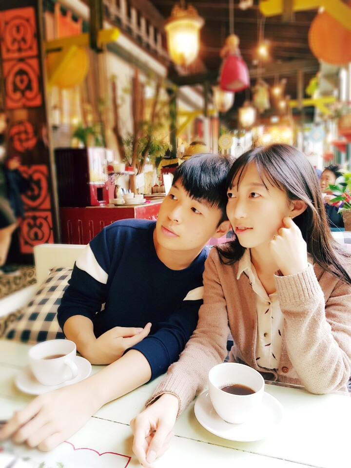

## About We

About Sung-Yub
Hello. My name is Sung-Yub Kim.
I am a graduate student in [MS/Optimization Lab in SNU](http://polytope.snu.ac.kr).
My interests are Optimization, RL, Deep Learning(especially [GAN](https://arxiv.org/abs/1406.2661)&[NTM](https://arxiv.org/abs/1410.5401)).
I will post here about those subjects.

If you have any issue on my posts or relevant subjects, pleas mail to <edmophia@snu.ac.kr>.
